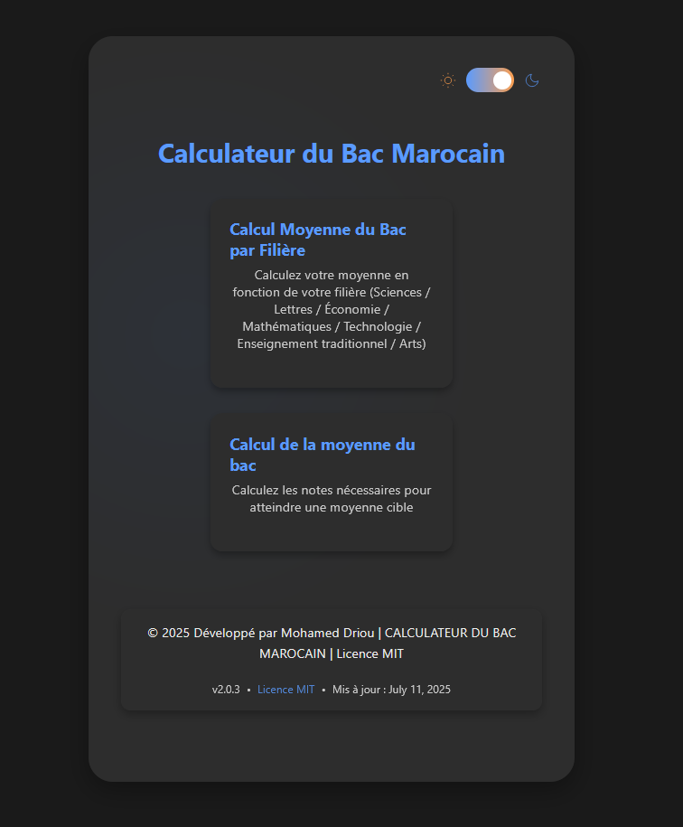

# 🇲🇦 Moroccan Baccalaureate Calculator

[](https://opensource.org/licenses/MIT)

A modern, multilingual web application to calculate the Moroccan Baccalaureate average, supporting various academic streams and student types.

---

## 🎓 Overview

This project provides students in Morocco with an accurate and user-friendly tool to calculate their final Baccalaureate scores. It supports:

- All main academic branches (e.g., Science, Literature, Economics, Math, Technical Sciences, Traditional Education, Applied Arts)
- Both **regular** and **independent** candidates
- National, regional, and continuous assessment components
- Advanced breakdown of calculations
- Support for optional subjects and special cases
- Multilingual UI with translation support

---

## 🚀 Features

- 🧠 Smart input validation  
- 📈 Coefficient-based weighted averages  
- 👥 Supports independent & regular students  
- 🗂️ Track selection and branch-specific logic  
- 💡 Detailed calculation breakdown  
- 🌓 Light/Dark mode support  
- 🌐 i18n internationalization  
- 🧾 Printable result page (planned)

---

## 📸 Screenshots

### 🖼️ Home Screen (Dark Mode)



---

## 🛠️ Built With

- **React.js**
- **Vite**
- **i18next** – for translations
- **CSS3** – custom styling with animations
- **React Hooks** – `useState`, `useEffect`, etc.

---

## 🧪 How to Use

1. **Clone the repository:**

```bash
git clone https://github.com/mohamed-driou/moroccan-bac-calculator.git
cd moroccan-bac-calculator
```

2. **Install dependencies:**

```bash
npm install
```

3. **Run the development server:**

```bash
npm run dev
```

4. Open your browser at:  
`http://localhost:5173`

---

## 📁 Project Structure

```
src/
├── App.jsx                   # Main entry
├── components/
│   ├── BacFormulaCalculator/
│   ├── Breadcrumbs/
│   ├── MainMenu/
│   └── SupportPage/
├── assets/
├── i18n/                     # Translation files
├── App.css
```

---

## 🌍 Internationalization (i18n)

- Language switcher supported  
- Default language: Arabic 🇲🇦  
- Easily extendable to French and English

---

## 💖 Support & Donate

If you find this project helpful, consider supporting it:

- **PayPal**: [https://paypal.me/adriou](https://paypal.me/adriou)
- **Binance ID**: `814551613`


---

## 📜 License

This project is licensed under the MIT License – see the [LICENSE](https://opensource.org/licenses/MIT) file for details.

---

## 👤 Author

**Mohamed Driou**  
💻 _Full-stack Web Developer (Student - Morocco/China)_  
📅 _Last updated: July 11, 2025_  
🔖 _Version: 2.0.3_

---

## 🤝 Contributions

Pull requests are welcome! For major changes, please open an issue first to discuss what you would like to change.

---

## 📌 Extras

Let me know if you'd like:

- 🇫🇷 French or 🇲🇦 Arabic versions of this `README.md`  
- 📷 Embedded screenshots  
- 🛡️ GitHub Actions or CI/CD setup  
- 📄 Auto-generated `LICENSE`

I'm happy to help!